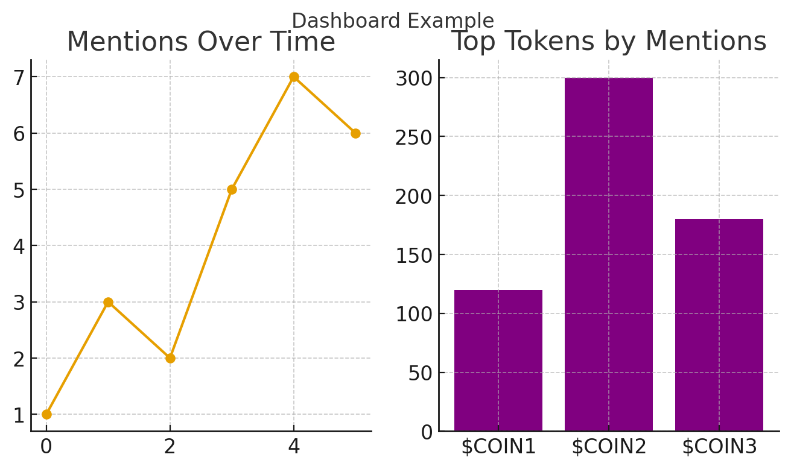
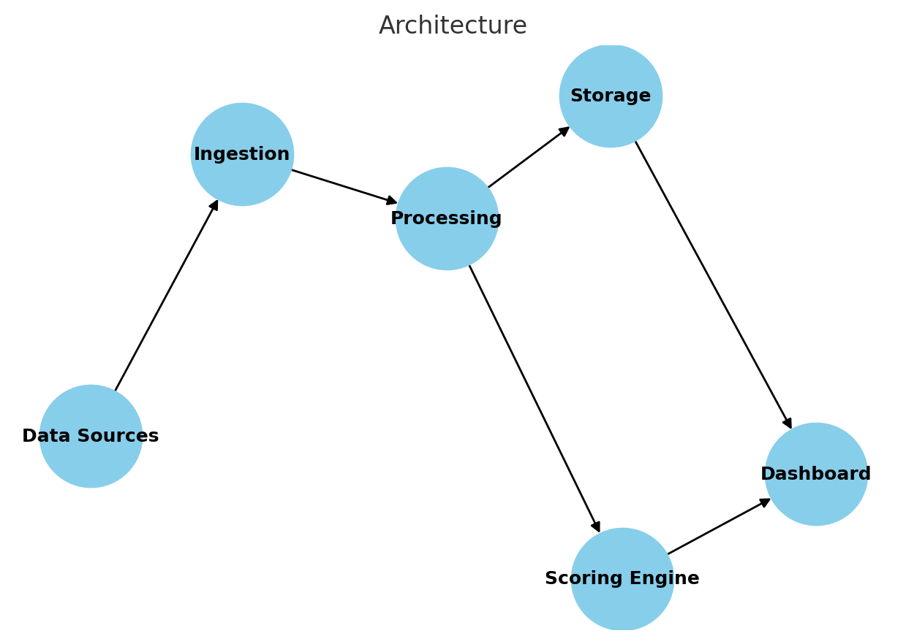
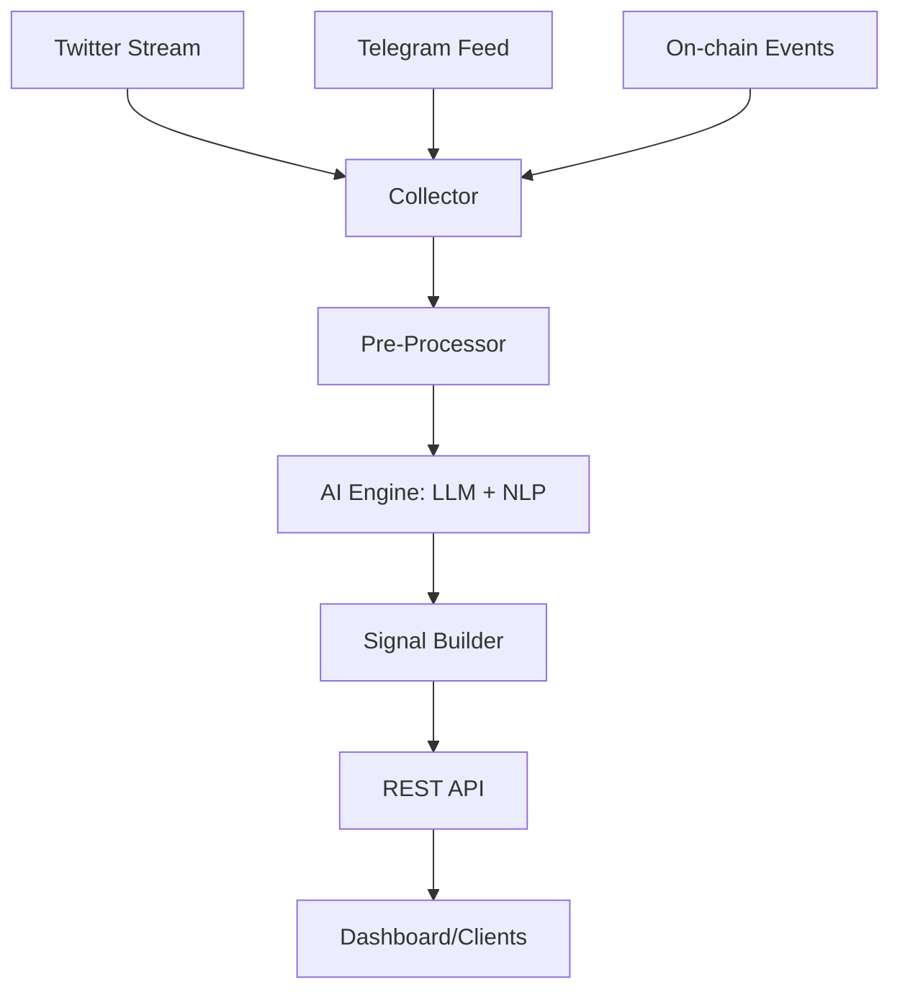
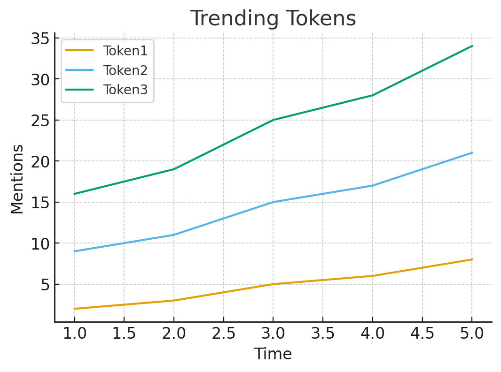
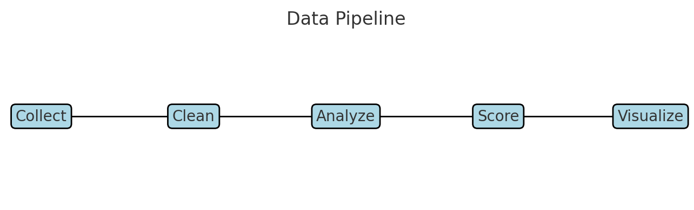
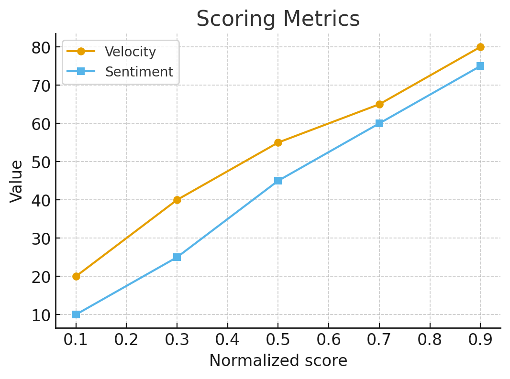

# 🐝 BuzzLens AI

**Turning noise into alpha.**  
BuzzLens AI is an end-to-end pipeline that listens to Crypto Twitter + Telegram + on‑chain chatter, extracts early narratives, and surfaces *tradeable* meme opportunities **before** they trend.



---

## ✨ Highlights
- 🔎 **Real-time scanning** of CT, Telegram and token mints (stream-friendly).
- 🤖 **AI scoring** (hype velocity, novelty, liquidity, sentiment shift).
- 🧠 **Prompt-engineered LLMs** to summarize noisy threads into crisp signals.
- 🧰 **API-first**: serve signals to your bots, dashboards, or alert channels.
- 📈 **Dashboard**: React + Chart.js demo for trends & mentions.
- 🐳 **Dockerized**, CI-ready (GitHub Actions).

> This repo is a realistic starter you can actually run and extend.

---

## 🏗 Architecture

```
Ingest  ->  Clean  ->  AI  ->  Score  ->  Serve  ->  Visualize
(Twitter/TG/On-chain)   (NLP)    (LLM + rules)  (API)      (Dashboard)
```





---

## ⚙️ Quick Start

```bash
git clone https://github.com/your-org/BuzzLensAI.git
cd BuzzLensAI

# Node services
npm install

# Python AI (optional for local scoring)
python -m venv .venv && source .venv/bin/activate
pip install -r ai/requirements.txt

# Env
cp .env.example .env

# Run API
npm run dev

# Run dashboard (separate terminal)
npm run dashboard
```

**Requirements**
- Node.js 20+, Python 3.10+
- OpenAI API key (or compatible)
- (Optional) Twitter bearer, Telegram bot token, Solana RPC
- MongoDB or Postgres if you enable persistence

---

## 📡 REST API

> Base URL: `http://localhost:3000`

### `GET /api/health`
Simple health check.

### `GET /api/signals/latest`
Latest aggregate signals.

**Response**
```json
{
  "asOf": "2025-09-19T12:00:00Z",
  "items": [
    {"token":"$BONK","hypeScore":0.87,"mentions24h":9123,"sentiment":"bullish","novelty":0.62},
    {"token":"$YUMI","hypeScore":0.74,"mentions24h":2811,"sentiment":"neutral","novelty":0.55}
  ]
}
```

### `GET /api/mentions/:token`
Time series of mentions.

### `POST /api/score`
Score a custom payload `{ text, liquidityUSD, mcap }`.

---

## 🧪 Example (Node)
```js
const fetch = require('node-fetch');

(async () => {
  const res = await fetch('http://localhost:3000/api/signals/latest');
  console.log(await res.json());
})();
```

## 🧠 Example (Python, local scoring)
```python
from ai.hype import hype_score
print(hype_score(velocity=0.7, novelty=0.5, sentiment=0.6, liquidity=80000, mcap=3_000_000))
```

---

## 📊 Dashboard
```
npm run dashboard
# http://localhost:5173
```
The demo UI renders:
- Top trends + hype score
- Mentions chart (Chart.js)
- Signal details




---

## 🔢 Scoring Basics
- **Velocity**: 0..1 growth of mentions (EMA over last N windows)
- **Novelty**: how new is the narrative vs. rolling dictionary
- **Sentiment shift**: last 1h vs 24h baseline
- **Liquidity & MCAP**: normalized safety/acceleration factors



Details in [`docs/SIGNALS.md`](docs/SIGNALS.md).

---

## 🧩 Repo Layout
```
src/
  api/               # Express API
  collector/         # Twitter/TG/on-chain inputs (stubs + real logic)
  pipelines/         # builders, scoring, persistence
  services/          # openai, dexscreener, telegram utils
dashboard/           # React + Vite + Tailwind + Chart.js
ai/                  # Python NLP + scoring
docs/                # Deep dives, prompts, architecture
tests/               # Jest + PyTest
docker/              # Dockerfile + compose
.github/workflows/   # CI
```

---

## 🛣 Roadmap
- v0.1: Local runner, basic API & dashboard
- v0.2: Realtime Twitter ingest + TG alerts
- v0.3: Backtests & signal export
- v1.0: Strategies & autotrade hooks

---

## 📜 License
MIT © BuzzLens AI

---

## 🌐 Community
- Twitter: https://x.com/BuzzLensAI
